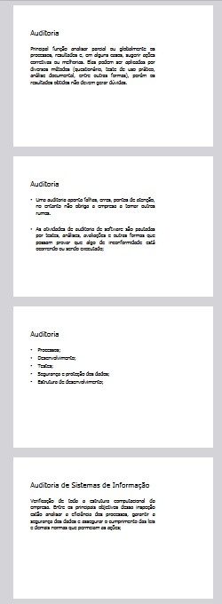

# SlideShow2Print

Transforme PDFs de apresentações em documentos formatados prontos para impressão!

## Como rodar

1. Clone esse repositório.
2. Navegue até a pasta.
3. Atualize as dependencias com o comando `npm install`.
4. Mova o arquivo pdf para ser convertido na mesma pasta do projeto.
5. Rode o projeto pelo seguinte comando `node index.js`.
6. Selecione um arquivo PDF digitando o seu número.
7. O arquivo convertido será salvo em `./outputPDF/` 

## Exemplo de saída

 

Input PDF ~> Output PDF